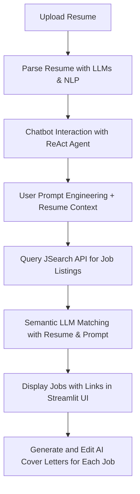

# SmartIntern - AI-Powered Internship & Job Assistant Agent

## 🔍 Overview
SmartIntern is a multi-agent AI application designed to automate and enhance the internship/job search process. It combines resume parsing, chatbot-based preference gathering, job listing retrieval via JSearch API, semantic similarity matching, and AI-generated cover letters. The system is modular, agent-based, and built for deployment with a sleek Streamlit UI, FastAPI backend and Deployed using Render.

---

## ⚙️ Tech Stack

| Layer           | Tools/Tech Used                                    |
|----------------|-----------------------------------------------------|
| Backend         | Python, FastAPI, LangChain, JSearch API |
| Frontend        | Streamlit                                          |
| LLM & NLP       | OpenAI LLMs |
| Agents          | ReAct, Adaptive RAG, Chatbot, Embeddings, Cover Letter Generator, Job Search Agent|
| Embeddings      | OpenAI |
| Deployment      | Docker, Render| 

---

## 🔄 Project Workflow

---

## 🖋️ Features

- ✉️ Resume Upload & LLM Parsing
- 🫵 Interactive Chatbot using ReAct + Reflection
- 🔢 Embedding-Based Job Similarity Matching
- 🔍 Job Scraping via JSearch API
- 📝 Personalized Cover Letter Generation

---

## 📊 Use Case Agents (LangGraph)

- **ReAct Agent**: Conversational reasoning to understand user preferences
- **Adaptive RAG**: Dynamically adapts to retrieve contextually relevant jobs
- **Plan-and-Execute**: (Optional future use) for timeline-based job tracking

---

## 🌐 Platforms Supported via JSearch API
- LinkedIn
- Glassdoor
- Internshala
- Wellfound
- Indeed

Note: These are accessed legally through JSearch (a middle-layer job API, not scraping directly).

---

## 👁️ Future Enhancements

- ✂️ Resume version control
- ⚖️ Matching score visualization
- 🌐 Slack/Discord integrations for job alerts
- 🕊 Dashboard for job application tracking

---

## 🚀 Contributing
Feel free to fork, raise issues, or submit pull requests for improvements!

---

## ✨ Maintained By KSAP and PODS
Built for Jobless people, free to Innovation.

### Website Link: [text](https://smartintern.onrender.com)