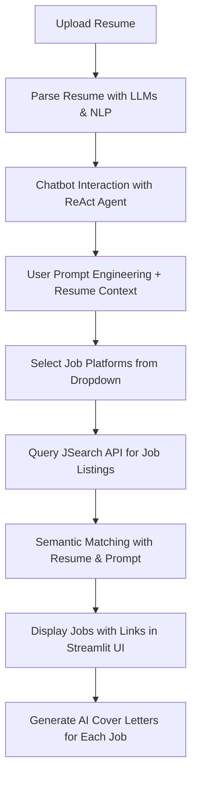

# SmartIntern - AI-Powered Internship & Job Assistant Agent

## 🔍 Overview
SmartIntern is a multi-agent AI application designed to automate and enhance the internship/job search process. It combines resume parsing, chatbot-based preference gathering, job listing retrieval via JSearch API, semantic similarity matching, and AI-generated cover letters. The system is modular, agent-based, and built for deployment with a sleek Streamlit UI and FastAPI backend.

---

## ⚙️ Tech Stack

| Layer           | Tools/Tech Used                                    |
|----------------|-----------------------------------------------------|
| Backend         | Python, FastAPI, LangGraph, LangChain, JSearch API |
| Frontend        | Streamlit                                          |
| LLM & NLP       | OpenAI, HuggingFace, Sentence Transformers         |
| Agents          | ReAct, Adaptive RAG, Corrective RAG, Plan-and-Execute |
| Embeddings      | SentenceTransformers, FAISS                        |

---

## 🔄 Project Workflow

---

## 🖋️ Features

- ✉️ Resume Upload & LLM Parsing
- 🫵 Interactive Chatbot using ReAct + Reflection
- 🔢 Embedding-Based Job Similarity Matching
- 🕐 Dropdown to Select Job Platform
- 🔍 Job Scraping via JSearch API
- 📝 Personalized Cover Letter Generation
- 📅 Modular, Agent-Based LangGraph Architecture

---

## 📊 Use Case Agents (LangGraph)

- **ReAct Agent**: Conversational reasoning to understand user preferences
- **Adaptive RAG**: Dynamically adapts to retrieve contextually relevant jobs
- **Corrective RAG**: Self-evaluates retrieval quality and retries if poor
- **Plan-and-Execute**: (Optional future use) for timeline-based job tracking

---

## 🌐 Platforms Supported via JSearch API
- LinkedIn
- Glassdoor
- Internshala
- Wellfound
- Indeed

Note: These are accessed legally through JSearch (a middle-layer job API, not scraping directly).

---

## 👁️ Future Enhancements

- ✂️ Resume version control
- ⚖️ Matching score visualization
- 🌐 Slack/Discord integrations for job alerts
- 🕊 Dashboard for job application tracking

---

## 📄 License
MIT License

## 🚀 Contributing
Feel free to fork, raise issues, or submit pull requests for improvements!

---

## ✨ Maintained By
Built with ❤️ by [Your Name] for Hackathon Innovation.

--
frontend/
├── Home.py
├── components/
│   ├── ResumeUploader.py
│   ├── ChatbotInterface.py
│   └── JobDisplay.py
└── utils/
    └── api.py     # Calls FastAPI endpoints

Use Case | Model
Resume Parsing | dslim/bert-base-NER
Semantic Search | all-MiniLM-L6-v2
Cover Letter + Chatbot | mistralai/Mistral-7B-Instruct-v0.2 via HF Inference API